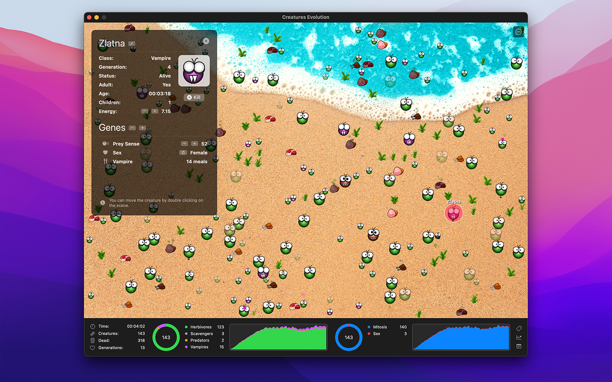

Creatures Evolution
===================

  

### About

A simulation of life's evolution through natural selection: peaceful herbivores, fearsome predators and vampires, which species will take over the world?

  - Watch little creatures live, die, eat, reproduce and mutate their genes to become the dominant species.
  - Create hundreds of different scenarios, as every part of the simulation can be customized.
  - Get detailed statistics about the genetic evolution of your creatures.

### Download

Creatures Evolution is [available on the AppStore](https://apps.apple.com/app/creatures-evolution/id1632663533).

License
-------

Project is released under the terms of the MIT License.

Repository Infos
----------------

    Owner:          Jean-David Gadina - XS-Labs
    Web:            www.xs-labs.com
    Blog:           www.noxeos.com
    Twitter:        @macmade
    GitHub:         github.com/macmade
    LinkedIn:       ch.linkedin.com/in/macmade/
    StackOverflow:  stackoverflow.com/users/182676/macmade
